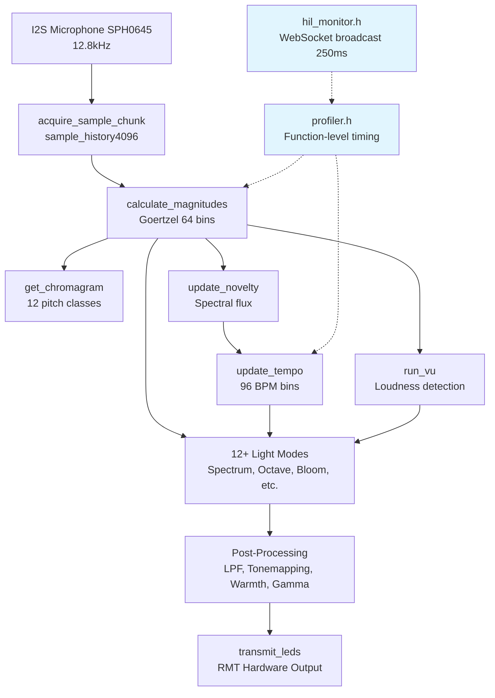
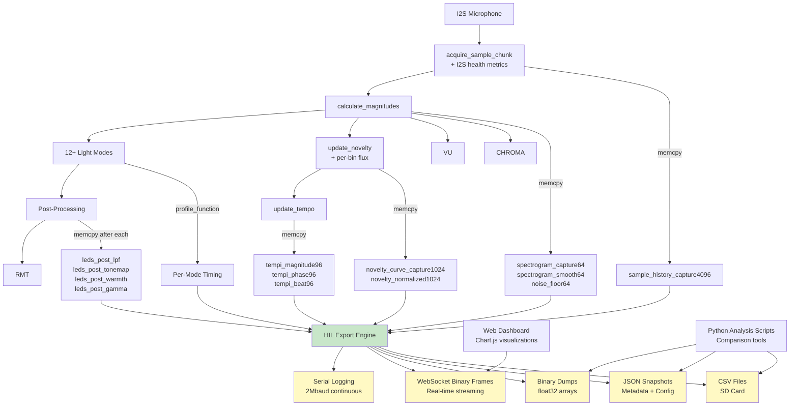
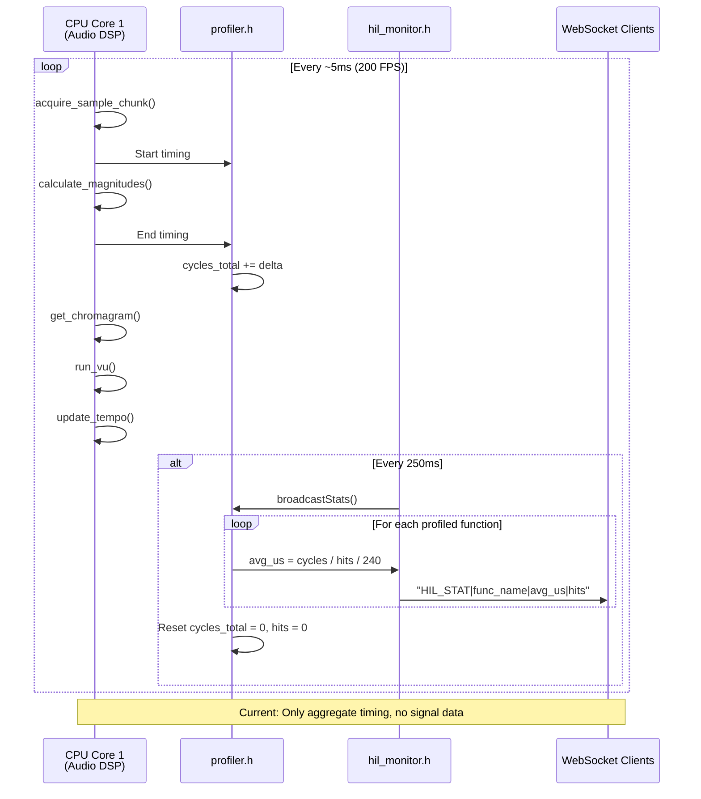
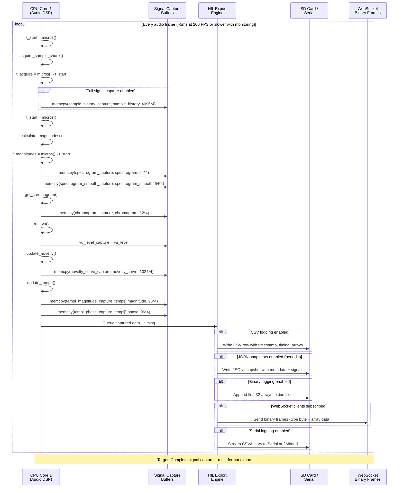
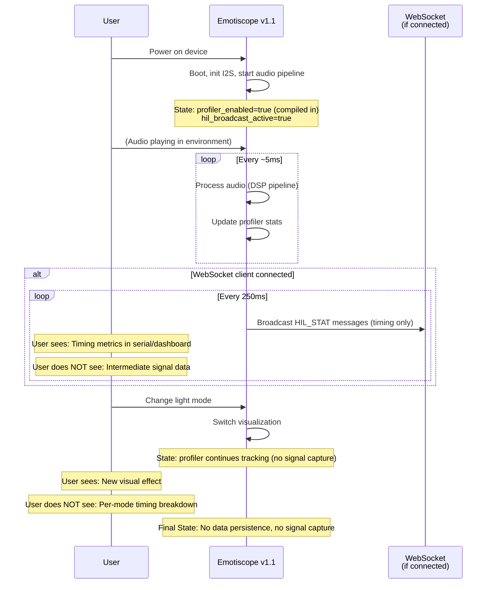
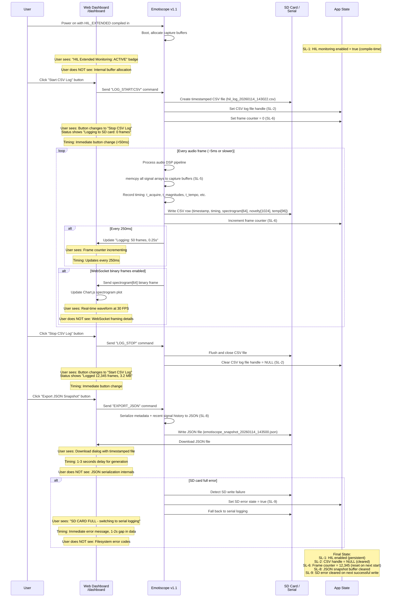
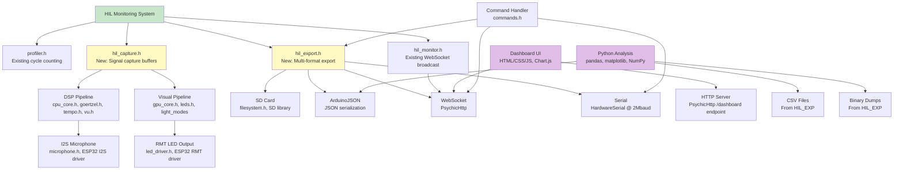

# Technical Implementation Blueprint: Comprehensive HIL Monitoring for Emotiscope v1.1

> **Traceability Note:** This Blueprint extracts from PRD sections §1-§10. All tables include "Source: PRD §X" annotations. Section numbers (§1-§11) are referenced by the Task List.

## §1. Current vs Target Analysis

### §1.1 Current System Architecture



**Current Limitations:**
- Timing only (DSP_MAGNITUDES_US, DSP_TEMPO_US) - no intermediate signal capture
- No per-frame array logging (spectrogram[64], novelty_curve[1024], tempi[96])
- No data export formats (CSV, JSON, binary, serial)
- No per-algorithm light mode timing
- WebSocket broadcasts only aggregate metrics, not signal arrays

### §1.2 Target System Architecture



**Target Capabilities:**
- **Audio Pipeline**: Full signal capture at every stage (sample_history, spectrogram, novelty, tempi)
- **Visual Pipeline**: Per-algorithm timing + intermediate LED buffers after each post-processing stage
- **Multi-Format Export**: Simultaneous CSV, JSON, binary, WebSocket, serial output
- **Dashboard**: Real-time signal visualization (spectrogram, novelty, tempi waveforms)
- **Benchmarking**: Timestamp-aligned exports for comparison with Lightwave-Ledstrip and Tab5.DSP

### §1.3 Current Data & Logic Flow



**Current Flow Limitations:**
- Timing aggregated over 250ms windows, no per-frame granularity
- No intermediate signal arrays captured (spectrogram, novelty, tempi)
- No data persistence (no CSV, JSON, binary export)
- WebSocket only sends text frames with timing metrics

### §1.4 Target Data & Logic Flow



**Target Flow Enhancements:**
- Per-frame signal capture with memcpy to separate buffers (non-blocking DSP)
- Microsecond-precision timing at each DSP stage
- Simultaneous export to all enabled formats (CSV, JSON, binary, WebSocket, serial)
- Configurable capture modes (timing-only, full signals, selective arrays)

### §1.5 Current User Journey with Data & State Flow
*Source: PRD §6 (current state), §8 (current state)*



**Current State Limitations:**
- No user control over data capture (always-on or always-off based on compile flags)
- No signal data visibility beyond real-time visualization
- No data export for offline analysis

### §1.6 Target User Journey with Data & State Flow
*Source: PRD §6 (V-1 to V-7, T-1 to T-7), §8 (SL-1 to SL-10)*



**Target User Experience:**
- Full control over data capture (start/stop commands from dashboard or serial)
- Real-time signal visualization in browser (spectrogram, novelty, tempi plots)
- Multi-format export with clear user feedback (file created, frames logged, errors)
- Graceful degradation (SD card full → serial fallback, WebSocket disconnect → logging continues)

### §1.7 Summary of Improvements
*Source: PRD §2 Problem Statement*

- **Black Box Algorithms → Full Signal Visibility**: Capture all intermediate DSP arrays (spectrogram[64], novelty_curve[1024], tempi[96], chromagram[12]) every frame for complete algorithmic transparency
- **No Empirical Validation → Benchmarking Infrastructure**: Export timestamp-aligned data in CSV/JSON/binary formats for side-by-side comparison with Lightwave-Ledstrip and Tab5.DSP using identical test signals
- **Limited Timing Visibility → Microsecond-Precision Breakdowns**: Per-stage timing (DSP_ACQUIRE_US, DSP_MAGNITUDES_US, DSP_VU_US, DSP_TEMPO_US) with sub-microsecond resolution using ESP.getCycleCount() at 240MHz
- **Inefficient Debugging → Multi-Hour Data Logging**: Continuous CSV/binary logging to SD card or serial for overnight benchmarks, with frame-by-frame signal capture for offline analysis in Python/MATLAB
- **Visual Pipeline Opacity → Per-Algorithm Timing**: Wrap all 12+ light mode draw() functions with profile_function() for execution time tracking, plus intermediate LED buffer capture after each post-processing stage

---

## §2. System Boundaries
*Source: PRD §7 Artifact Ownership*

### §2.1 Artifact Ownership Enforcement
*Source: PRD §7.1 Creation Responsibility*

| PRD ID | Artifact | Created By | App's Role | Implementation Rule |
|--------|----------|------------|------------|---------------------|
| O-1 | CSV log files (hil_log_*.csv) | Emotiscope firmware | Create: Open file on LOG_START, write rows every frame | App creates unique timestamped filenames, writes CSV header + data rows |
| O-2 | Binary signal dumps (spectrogram_*.bin) | Emotiscope firmware | Create: Write float32 arrays with header, rotate every N frames | App creates binary files with magic bytes + array metadata header |
| O-3 | JSON snapshot files (emotiscope_snapshot_*.json) | Emotiscope firmware | Create: Serialize on demand (user request or periodic) | App generates JSON with metadata + recent signal history |
| O-4 | Dashboard HTML/JS files | Emotiscope firmware (embedded) | Create: Compile-time embed, runtime serve at /dashboard | App embeds static files in flash, serves via PsychicHttp |
| O-5 | SD card directories (/logs/YYYYMMDD/) | Emotiscope firmware | Create: mkdir on first write of each day | App creates directory structure, handles filesystem errors |
| O-6 | WebSocket binary frames (signal data) | Emotiscope firmware | Create: Serialize arrays to binary frames every frame (or decimated) | App creates binary frames with type byte + array payload |
| O-7 | Serial log output stream | Emotiscope firmware | Create: Format CSV/binary to serial continuously when enabled | App writes to Serial at 2Mbaud, handles buffer overruns |
| O-8 | Python analysis scripts (comparison tools) | Developer (external) | Observe: Scripts load app-created CSV/JSON/binary files | App does NOT load Python scripts, only creates data files |
| O-9 | Test signal audio files (.wav) | Developer (external) | Observe: Audio played to device via microphone/line-in | App does NOT create test signals, only processes input from I2S |
| O-10 | Intermediate signal arrays (spectrogram, novelty, tempi) | Emotiscope firmware (DSP) | Observe: HIL monitoring reads (memcpy) but does NOT modify DSP | App observes DSP outputs without affecting algorithm operation |

### §2.2 External System Behaviors
*Source: PRD §7.2 External System Dependencies*

| PRD ID | External System | Autonomous Actions | App's Response | Detection Method |
|--------|-----------------|-------------------|----------------|------------------|
| E-1 | SD Card Filesystem | Creates file allocation tables, directory entries, FAT structures | App checks SD.begin() result, handles file.write() errors, falls back to serial | SD.begin() returns true/false, file.write() returns bytes written |
| E-2 | WebSocket Client (browser) | Initiates TCP connection, sends HTTP upgrade request, closes connection autonomously | App adds client to list on onOpen(), removes on onClose(), continues logging if disconnected | PsychicHttp onOpen() and onClose() callbacks fire |
| E-3 | External Audio Source | Produces audio signal (sine waves, music, etc.) | App processes whatever I2S microphone receives, cannot distinguish test vs live | I2S DMA buffer receives samples (no metadata about source) |
| E-4 | NTP Time Server (optional) | Sets system time via SNTP protocol | App uses millis() or time() for timestamps, falls back to relative time if NTP unavailable | ESP32 SNTP library updates system clock, app checks time() != 0 |
| E-5 | Python Analysis Environment | Loads CSV/JSON/binary files, generates plots, external to device | App completes by creating data files, no interaction with Python | Not detectable by app (post-processing on PC) |

### §2.3 Boundary Rules
*Source: PRD §7.3 Derived Ownership Rules*

| PRD Source | Rule | Rationale | Enforcement |
|------------|------|-----------|-------------|
| O-1, O-2, O-3 | ✅ MUST: Create unique timestamped filenames for all logs to prevent overwrites | Each capture session must produce distinct files for comparison | Filename includes YYYYMMDD_HHMMSS timestamp from millis() or time() |
| O-4 | ✅ MUST: Embed dashboard HTML/JS at compile time (not load from SD card) | Dashboard must work even if SD card is removed or corrupted | Files embedded as PROGMEM strings or LittleFS compile-time bundle |
| O-10 | ❌ DO NOT: Modify DSP algorithm behavior when HIL monitoring is active | Captured data must reflect actual operation, not altered by monitoring | HIL code only reads (memcpy) after DSP functions complete, no branches in DSP |
| E-1 | ✅ MUST: Detect SD card presence before file writes and fall back gracefully | Cannot assume SD card is present or has space | Check SD.begin() at startup, catch file.write() errors, switch to serial |
| E-2 | ❌ DO NOT: Block audio pipeline if WebSocket send buffer is full | Real-time DSP more critical than dashboard updates | WebSocket sends are non-blocking, drop frames if buffer full |
| E-2 | ✅ MUST: Continue data logging even if WebSocket clients disconnect | Dashboard is optional, SD/serial logging is primary | Logging state independent of WebSocket connection state |
| O-6 | ❌ DO NOT: Wait for WebSocket acknowledgment before processing next frame | Real-time constraint: process audio every ~5ms regardless of network | Async WebSocket send, fire-and-forget for binary frames |
| O-7 | ✅ MUST: Flush serial buffer periodically to prevent overruns | Serial at 2Mbaud has limited buffer (~1KB), high-volume logging can overflow | Serial.flush() every 100 frames or use DMA if available |
| O-8, O-9 | ❌ DO NOT: Attempt to load external Python scripts or test signals | External analysis tools operate on app outputs, not inputs to app | App only writes data files, never executes external code |
| E-3 | ❌ DO NOT: Assume test signal metadata is available via I2S | I2S provides raw PCM samples without source identification | App timestamps audio frames relative to boot, external sync required for comparison |

---

## §3. State Transition Specifications
*Source: PRD §8 State Requirements*

### §3.1 Transition: Enable Extended HIL Monitoring
*Source: PRD §8.2 SL-1*

**Trigger:** Device boot with #define HIL_EXTENDED in platformio.ini

**Pre-conditions (State Before):**
*Source: PRD §8.1 State Isolation, §8.2 Lifecycle*

| PRD ID | State Variable | Current Value | Required Action |
|--------|----------------|---------------|----------------|
| SL-1 | hil_extended_enabled | false (default) | SET to true if compiled in |
| SL-5 | Signal capture buffers | Unallocated | ALLOCATE on heap (malloc) |

**Post-conditions (State After):**
*Source: PRD §8.2 Lifecycle*

| PRD ID | State Variable | New Value | Set By |
|--------|----------------|-----------|--------|
| SL-1 | hil_extended_enabled | true | setup() function during boot |
| SL-5 | Signal capture buffers | Allocated (spectrogram_capture[64], novelty_capture[1024], etc.) | malloc() in setup() |

**Side Effects:**
- Serial output prints "HIL Extended Monitoring: ACTIVE" message
- Dashboard shows ACTIVE badge (if WebSocket connected)
- Memory allocated: ~20KB for all signal capture buffers
- Monitoring overhead active from boot (no performance constraints per NFR-1)

### §3.2 Transition: Start CSV Logging
*Source: PRD §8.2 SL-2, SL-6*

**Trigger:** User sends "LOG_START:CSV" command via serial or dashboard

**Pre-conditions (State Before):**

| PRD ID | State Variable | Current Value | Required Action |
|--------|----------------|---------------|----------------|
| SL-1 | hil_extended_enabled | true | VERIFY enabled before allowing log start |
| SL-2 | CSV log file handle | NULL | VERIFY not already logging |
| E-1 | SD card availability | Unknown | CHECK SD.begin() returns true |

**Post-conditions (State After):**

| PRD ID | State Variable | New Value | Set By |
|--------|----------------|-----------|--------|
| SL-2 | CSV log file handle | Valid file handle | SD.open("hil_log_YYYYMMDD_HHMMSS.csv", FILE_WRITE) |
| SL-6 | Frame counter | 0 | Reset to 0 on log start |
| SL-9 | SD card error state | false (success) or true (failure) | Set based on SD.open() result |

**Side Effects:**
- CSV header row written: "timestamp,DSP_ACQUIRE_US,DSP_MAGNITUDES_US,...,spectrogram_0,...,spectrogram_63"
- Dashboard status updates: "Logging to SD card: 0 frames"
- If SD card unavailable, fall back to serial logging and set SL-10 serial_logging_active = true

### §3.3 Transition: Capture and Export Frame Data
*Source: PRD §8.2 SL-5, SL-6*

**Trigger:** Every audio frame completion (run_cpu() iteration)

**Pre-conditions (State Before):**

| PRD ID | State Variable | Current Value | Required Action |
|--------|----------------|---------------|----------------|
| SL-2 | CSV log file handle | Valid | VERIFY logging active |
| SL-5 | Signal capture buffers | Allocated | VERIFY buffers exist |
| O-10 | DSP intermediate arrays | Updated by current frame | READ-ONLY access for memcpy |

**Post-conditions (State After):**

| PRD ID | State Variable | New Value | Set By |
|--------|----------------|-----------|--------|
| SL-5 | Signal capture buffers | Filled with current frame data | memcpy(spectrogram_capture, spectrogram, sizeof(float)*64) etc. |
| SL-6 | Frame counter | Incremented by 1 | frame_counter++ after successful write |
| SL-2 | CSV log file | New row appended | file.printf("%lu,%.4f,%.4f,...", millis(), t_acquire, t_magnitudes, ...) |

**Side Effects:**
- CSV row written to SD card (~1-5ms if synchronous write, queued if async)
- Binary frames sent via WebSocket if clients subscribed (fire-and-forget)
- Serial output if serial logging enabled
- Memory usage: capture buffers reused (no allocation per frame)

### §3.4 Transition: Stop CSV Logging
*Source: PRD §8.2 SL-2, SL-6*

**Trigger:** User sends "LOG_STOP" command via serial or dashboard

**Pre-conditions (State Before):**

| PRD ID | State Variable | Current Value | Required Action |
|--------|----------------|---------------|----------------|
| SL-2 | CSV log file handle | Valid | VERIFY currently logging |
| SL-6 | Frame counter | N (number of frames logged) | PRESERVE final count for status display |

**Post-conditions (State After):**

| PRD ID | State Variable | New Value | Set By |
|--------|----------------|-----------|--------|
| SL-2 | CSV log file handle | NULL | file.close(), handle = NULL |
| SL-6 | Frame counter | 0 (reset for next session) | Reset after displaying final count |
| SL-9 | SD card error state | Cleared if was set | Reset to false on successful close |

**Side Effects:**
- File flushed and closed (SD card sync)
- Dashboard status updates: "Logged 12,345 frames, 3.2 MB"
- Signal capture buffers remain allocated (SL-5 not cleared, reused for next session)
- CSV log file available for download or Python analysis

### §3.5 Transition: Export JSON Snapshot
*Source: PRD §8.2 SL-8*

**Trigger:** User sends "EXPORT_JSON" command via dashboard or serial

**Pre-conditions (State Before):**

| PRD ID | State Variable | Current Value | Required Action |
|--------|----------------|---------------|----------------|
| SL-8 | JSON snapshot buffer | Contains recent 10s signal history (circular) | READ for serialization |
| SL-1 | hil_extended_enabled | true | VERIFY monitoring active |

**Post-conditions (State After):**

| PRD ID | State Variable | New Value | Set By |
|--------|----------------|-----------|--------|
| SL-8 | JSON snapshot buffer | Cleared after export | Optionally reset circular buffer head |
| O-3 | JSON file | Created: emotiscope_snapshot_YYYYMMDD_HHMMSS.json | ArduinoJSON serialization + SD.write() |

**Side Effects:**
- JSON file written with: metadata (sample_rate, firmware_version, hardware_version), algorithm parameters (Goertzel block_sizes, coeff, tempo ranges), recent signal history (last 10s of spectrogram, novelty, tempi)
- Dashboard download dialog appears (1-3 second generation time per T-4)
- Memory spike during JSON serialization (~10-20KB temporary buffer)

### §3.6 Transition: WebSocket Client Subscribe to Arrays
*Source: PRD §8.2 SL-4*

**Trigger:** WebSocket client sends "SUBSCRIBE:spectrogram" message

**Pre-conditions (State Before):**

| PRD ID | State Variable | Current Value | Required Action |
|--------|----------------|---------------|----------------|
| E-2 | WebSocket client connection | Connected | VERIFY client in active list |
| SL-4 | Client subscription mask | 0x0000 (none) | UPDATE with requested array bit |

**Post-conditions (State After):**

| PRD ID | State Variable | New Value | Set By |
|--------|----------------|-----------|--------|
| SL-4 | Client subscription mask | 0x0001 (spectrogram bit set) | Bitmask |= (1 << ARRAY_SPECTROGRAM) |

**Side Effects:**
- Client begins receiving binary frames for subscribed array every frame (or decimated to 30 FPS)
- Other clients unaffected (per-client subscription masks per SI-3)
- No change to logging or capture (WebSocket independent per SI-4)

### §3.7 Transition: SD Card Full → Serial Fallback
*Source: PRD §8.2 SL-9, SL-10*

**Trigger:** file.write() returns 0 or SD card error detected

**Pre-conditions (State Before):**

| PRD ID | State Variable | Current Value | Required Action |
|--------|----------------|---------------|----------------|
| SL-2 | CSV log file handle | Valid | ATTEMPT write, detect failure |
| SL-9 | SD card error state | false | SET to true on error |
| SL-10 | Serial logging active | false | ACTIVATE fallback |

**Post-conditions (State After):**

| PRD ID | State Variable | New Value | Set By |
|--------|----------------|-----------|--------|
| SL-2 | CSV log file handle | NULL (closed) | file.close() on error |
| SL-9 | SD card error state | true | Set by error handler |
| SL-10 | Serial logging active | true | Fallback activation |

**Side Effects:**
- Serial output: "SD CARD FULL - switching to serial logging" error message (V-7)
- CSV data continues streaming to Serial at 2Mbaud instead of SD card
- Dashboard shows error status (if WebSocket connected)
- Potential 1-2 second gap in logged data during transition (T-7)

---

## §4. Integration Wiring
*Derived from: PRD §7 (ownership), §8 (state), §6 (visibility)*

### §4.1 Audio Pipeline Signal Capture Integration
*Implements: PRD §7.1 O-10, §6.1 V-3, §8.2 SL-5*

```
run_cpu()  // cpu_core.h line 17
  ├─ FIRST: t_start = micros()
  ├─ THEN: acquire_sample_chunk()  // microphone.h
  ├─ THEN: t_acquire = micros() - t_start
  ├─ HIL: HILMonitor::log("DSP_ACQUIRE_US", t_acquire)
  │
  ├─ IF: hil_extended_enabled && capture_mode_full
  │   └─ memcpy(sample_history_capture, sample_history, sizeof(float)*4096)
  │
  ├─ t_start = micros()
  ├─ calculate_magnitudes()  // goertzel.h
  ├─ t_magnitudes = micros() - t_start
  ├─ HIL: HILMonitor::log("DSP_MAGNITUDES_US", t_magnitudes)
  │
  ├─ CRITICAL: memcpy AFTER calculate_magnitudes completes
  │   ├─ memcpy(spectrogram_capture, spectrogram, sizeof(float)*64)
  │   ├─ memcpy(spectrogram_smooth_capture, spectrogram_smooth, sizeof(float)*64)
  │   └─ memcpy(chromagram_capture, chromagram, sizeof(float)*12)
  │
  ├─ get_chromagram()  // goertzel.h
  ├─ run_vu()  // vu.h
  ├─ t_start = micros()
  ├─ update_tempo()  // tempo.h
  ├─ t_tempo = micros() - t_start
  ├─ HIL: HILMonitor::log("DSP_TEMPO_US", t_tempo)
  │
  ├─ CRITICAL: memcpy AFTER update_tempo completes
  │   ├─ memcpy(novelty_curve_capture, novelty_curve, sizeof(float)*1024)
  │   ├─ memcpy(tempi_magnitude_capture, tempi[].magnitude, sizeof(float)*96)
  │   └─ memcpy(tempi_phase_capture, tempi[].phase, sizeof(float)*96)
  │
  └─ FINALLY: hil_export_frame_data()  // Queue or write immediately
```

**Call Sequence:**

| Order | Call | Purpose | PRD Source | Critical |
|-------|------|---------|------------|----------|
| 1 | t_start = micros() | Start timing for I2S acquisition | §6.2 T-1 | Yes |
| 2 | acquire_sample_chunk() | Read 64 samples from I2S DMA buffer | FR-1 | Yes |
| 3 | HILMonitor::log("DSP_ACQUIRE_US", ...) | Log I2S read timing | FR-2, V-3 | Yes |
| 4 | memcpy(sample_history_capture, ...) | Capture raw samples if full mode | FR-1, SL-5 | No (conditional) |
| 5 | calculate_magnitudes() | Goertzel algorithm on 64 bins | FR-1 | Yes |
| 6 | memcpy(spectrogram_capture, ...) AFTER | Capture frequency magnitudes | FR-1, O-10 | Yes (timing critical) |
| 7 | update_tempo() | Tempo/beat detection on novelty domain | FR-1 | Yes |
| 8 | memcpy(novelty_curve_capture, ...) AFTER | Capture tempo arrays | FR-1, O-10 | Yes (timing critical) |
| 9 | hil_export_frame_data() | Write captured data to CSV/binary/WebSocket | FR-5-FR-9 | Yes |

**Critical Timing Notes:**
- memcpy MUST occur AFTER each DSP function completes to ensure bit-exact signal capture (NFR-6)
- memcpy overhead: ~1-5µs per array (spectrogram[64]=256B, novelty[1024]=4KB, tempi[96]=384B)
- Total capture overhead: ~10-20µs per frame (acceptable per NFR-1, no performance constraints)

### §4.2 Visual Pipeline Light Mode Timing Integration
*Implements: PRD §5.6 Story, FR-3, §8.2 SL-1*

```
run_gpu()  // gpu_core.h line 17
  ├─ t_now_us = micros()
  ├─ delta = (t_now_us - t_last_us) / (1000000 / REFERENCE_FPS)
  │
  ├─ clear_display()
  │
  ├─ WRAP: profile_function with mode name
  │   ├─ t_mode_start = ESP.getCycleCount()
  │   ├─ light_modes[configuration.current_mode].draw()
  │   └─ t_mode_end = ESP.getCycleCount()
  │
  ├─ HIL: HILMonitor::log(mode_name_us, (t_mode_end - t_mode_start) / 240.0)
  │
  ├─ IF: hil_extended_enabled && capture_led_buffers
  │   └─ memcpy(leds_pre_postproc_capture, leds, sizeof(CRGBF)*NUM_LEDS)
  │
  ├─ t_lpf_start = micros()
  ├─ apply_image_lpf(lpf_cutoff_frequency)
  ├─ HIL: HILMonitor::log("GPU_LPF_US", micros() - t_lpf_start)
  ├─ IF: capture_led_buffers
  │   └─ memcpy(leds_post_lpf_capture, leds, sizeof(CRGBF)*NUM_LEDS)
  │
  ├─ apply_tonemapping()
  ├─ IF: capture_led_buffers
  │   └─ memcpy(leds_post_tonemap_capture, leds, sizeof(CRGBF)*NUM_LEDS)
  │
  ├─ apply_warmth(configuration.warmth)
  ├─ IF: capture_led_buffers
  │   └─ memcpy(leds_post_warmth_capture, leds, sizeof(CRGBF)*NUM_LEDS)
  │
  ├─ apply_gamma_correction()
  ├─ IF: capture_led_buffers
  │   └─ memcpy(leds_post_gamma_capture, leds, sizeof(CRGBF)*NUM_LEDS)
  │
  └─ transmit_leds()  // RMT hardware output
```

**Call Sequence:**

| Order | Call | Purpose | PRD Source | Critical |
|-------|------|---------|------------|----------|
| 1 | profile_function([&]() { light_modes[].draw(); }, mode_name) | Wrap draw() with timing | FR-3, Story §5.6 | Yes |
| 2 | memcpy(leds_pre_postproc_capture, leds, ...) | Capture raw mode output before post-proc | FR-4 | No |
| 3 | apply_image_lpf() + timing | Low-pass filter with timing | Story §5.7 | Yes |
| 4 | memcpy(leds_post_lpf_capture, leds, ...) AFTER | Capture after LPF | FR-4, Story §5.7.1 | No |
| 5 | apply_tonemapping() | Dynamic range compression | Story §5.7 | Yes |
| 6 | memcpy(leds_post_tonemap_capture, ...) AFTER | Capture after tonemapping | FR-4, Story §5.7.2 | No |
| 7 | apply_warmth() | Incandescent LUT application | Story §5.7 | Yes |
| 8 | memcpy(leds_post_warmth_capture, ...) AFTER | Capture after warmth | FR-4, Story §5.7.3 | No |
| 9 | apply_gamma_correction() | Gamma correction | Story §5.7 | Yes |
| 10 | memcpy(leds_post_gamma_capture, ...) AFTER | Capture final pre-quantization output | FR-4, Story §5.7.4 | No |

**LED Buffer Capture Notes:**
- Each leds[] array: NUM_LEDS * sizeof(CRGBF) = NUM_LEDS * 12 bytes (3 floats: r, g, b)
- Typical NUM_LEDS=150: 150*12=1800 bytes per capture
- 5 captures per frame (pre-postproc + 4 post-processing stages): ~9KB per frame
- Conditional capture (capture_led_buffers flag) to manage memory (only enable for specific debugging)

### §4.3 Multi-Format Export Wiring
*Implements: PRD §5.9-§5.13 Stories, FR-5-FR-9, §7.1 O-1, O-2, O-6, O-7*

```
hil_export_frame_data()  // New function in hil_monitor.h or separate hil_export.h
  ├─ IF: csv_logging_enabled (SL-2 handle != NULL)
  │   ├─ CRITICAL: Format CSV row with timestamp first
  │   ├─ csv_row = sprintf("%lu,%d,%d,...", millis(), t_acquire, t_magnitudes, ...)
  │   ├─ FOR: each array (spectrogram[64], novelty[1024], etc.)
  │   │   └─ csv_row += sprintf(",%.4f", array[i])
  │   ├─ csv_row += "\n"
  │   └─ file.write(csv_row)  // Or queue for async write
  │
  ├─ IF: binary_logging_enabled
  │   ├─ FOR: each enabled array type
  │   │   ├─ binary_file[array_type].write(&array_length, sizeof(uint16_t))
  │   │   └─ binary_file[array_type].write(array_data, sizeof(float)*array_length)
  │   └─ Check file size, rotate if > 10MB
  │
  ├─ IF: websocket_binary_enabled && clients_subscribed
  │   ├─ FOR: each subscribed array type per client
  │   │   ├─ binary_frame[0] = array_type_byte  // 0x01=spectrogram, 0x02=novelty, etc.
  │   │   ├─ memcpy(&binary_frame[1], &array_length, sizeof(uint16_t))
  │   │   ├─ memcpy(&binary_frame[3], array_data, sizeof(float)*array_length)
  │   │   └─ client.sendBinary(binary_frame, frame_size)  // Non-blocking, drop if buffer full
  │   └─ Handle send failures gracefully (per E-2 boundary rule)
  │
  ├─ IF: serial_logging_enabled (SL-10 or SD fallback)
  │   ├─ Serial.write(csv_row)  // Same format as CSV file
  │   └─ Serial.flush() every 100 frames to prevent buffer overrun
  │
  └─ EVERY: 1000 frames (or on user command)
      └─ IF: json_snapshot_enabled
          ├─ Generate JSON with ArduinoJSON
          ├─ Include: metadata, algorithm params, recent signal history
          └─ Write to SD or send via WebSocket
```

**Call Sequence:**

| Order | Call | Purpose | PRD Source | Critical |
|-------|------|---------|------------|----------|
| 1 | Format CSV row with timestamp + timing | Timestamp alignment for benchmarking | FR-5, Story §5.9 | Yes |
| 2 | Append all captured arrays to CSV row | Flatten arrays into columns (spectrogram_0 to spectrogram_63) | FR-5, Story §5.9.3 | Yes |
| 3 | file.write(csv_row) | Write to SD card if CSV logging active | O-1, SL-2 | Yes |
| 4 | Write binary dumps with header | Float32 arrays for MATLAB/NumPy | FR-7, Story §5.11 | No (conditional) |
| 5 | Rotate binary files if > 10MB | Prevent single huge files | Story §5.11.4 | No |
| 6 | Send WebSocket binary frames per client subscription | Real-time streaming to dashboard | FR-8, Story §5.12, SL-4 | No |
| 7 | Drop WebSocket frames if send buffer full | Non-blocking, don't block DSP | E-2 boundary rule | Yes (critical for real-time) |
| 8 | Serial.write(csv_row) if serial logging | Fallback or primary if no SD | FR-9, Story §5.13, SL-10 | No |
| 9 | Serial.flush() periodically | Prevent serial buffer overrun | O-7 boundary rule | Yes |

**Export Performance Notes:**
- CSV row formatting: ~100-500µs depending on number of arrays (sprintf overhead)
- SD card write: 1-20ms per block (blocking), use async write or queue for non-blocking
- WebSocket binary send: ~50-200µs non-blocking (if buffer available)
- Serial write: ~500µs for 1KB at 2Mbaud (relatively fast)
- Total export overhead: ~2-25ms per frame (acceptable per NFR-1, no performance constraints)

---

## §5. System Components
*Source: PRD §4.1 Functional Requirements, CODEBASE_CONTEXT*

### §5.1 Firmware Components (ESP32-S3 Embedded)

| Component | File Location | Purpose | PRD Source |
|-----------|---------------|---------|------------|
| **Audio DSP Pipeline** | cpu_core.h (run_cpu) | Existing audio processing: I2S capture, Goertzel, VU, tempo | Background (existing) |
| **Existing Profiler** | profiler.h | Function-level cycle counting with ESP.getCycleCount(), broadcasts stats | Background (existing) |
| **Existing HIL Monitor** | hil_monitor.h | WebSocket metric broadcasting every 250ms, text frame format | Background (existing) |
| **Signal Capture Buffers** | hil_capture.h (new) | Separate buffers for memcpy: spectrogram_capture[64], novelty_capture[1024], tempi_magnitude[96], tempi_phase[96], sample_history_capture[4096], leds_post_lpf[NUM_LEDS], etc. | FR-1, FR-4, SL-5 |
| **HIL Export Engine** | hil_export.h (new) | Multi-format export coordinator: formats CSV rows, writes binary files, sends WebSocket frames, streams serial | FR-5-FR-9, Stories §5.9-§5.13 |
| **CSV Logger** | hil_export.h | Creates timestamped CSV files, writes header + data rows, handles file rotation | FR-5, Story §5.9, O-1 |
| **Binary Dumper** | hil_export.h | Creates .bin files with magic header (0x48494C01), writes float32 arrays, rotates at 10MB | FR-7, Story §5.11, O-2 |
| **JSON Snapshotter** | hil_export.h | Uses ArduinoJSON to serialize metadata + algorithm params + recent signal history | FR-6, Story §5.10, O-3 |
| **WebSocket Binary Frames** | hil_export.h + wireless.h | Extends broadcast() to support binary frames (type byte + payload), per-client subscriptions | FR-8, Story §5.12, O-6, SL-4 |
| **Serial Logger** | hil_export.h | Streams CSV or binary to Serial at 2Mbaud, fallback for SD card errors | FR-9, Story §5.13, O-7, SL-10 |
| **Command Handler** | commands.h (extend) | Parses LOG_START, LOG_STOP, SUBSCRIBE, EXPORT_JSON, LOG_STATUS commands from serial or WebSocket | FR-10, FR-11, Stories §5.18 |
| **Dashboard HTML/JS** | data/ directory (embedded) | Chart.js-based web page with signal plots, timing tables, capture controls | FR-12, Stories §5.16-§5.18, O-4 |
| **SD Card Interface** | filesystem.h + SD library | SD.begin(), file creation, directory management, error detection | E-1, SL-2, SL-9 |
| **Visual Pipeline Timing** | gpu_core.h (extend) | Wrap light_modes[].draw() with profile_function(), timing for post-processing stages | FR-3, Story §5.6 |
| **LED Buffer Capture** | hil_capture.h (new) | Capture leds[] CRGBF array after each post-processing stage (LPF, tonemapping, warmth, gamma) | FR-4, Story §5.7 |

### §5.2 External Analysis Tools (Off-Device)

| Component | Technology | Purpose | PRD Source |
|-----------|-----------|---------|------------|
| **Python Comparison Scripts** | Python 3.x + pandas + matplotlib + NumPy | Load CSV/JSON/binary exports from v1.1, Lightwave-Ledstrip, Tab5.DSP; generate comparison plots | Story §5.15, O-8 |
| **Test Signal Library** | .wav files | Sine sweeps, white noise, percussive transients, music samples for benchmarking | Story §5.14, O-9 |
| **MATLAB/NumPy Signal Analysis** | MATLAB or Python NumPy/SciPy | Load binary dumps (.bin files), perform advanced DSP analysis (FFT, correlation, etc.) | FR-7, Story §5.11 |

---

## §6. Data Models
*Source: PRD §4.1 Functional Requirements, CODEBASE_CONTEXT*

### §6.1 In-Memory Data Structures (C/C++)

```cpp
// hil_capture.h - Signal Capture Buffers (SL-5)
struct hil_capture_buffers {
    // Audio pipeline captures (allocated on boot if HIL_EXTENDED enabled)
    float sample_history_capture[4096];          // Raw I2S samples
    float spectrogram_capture[64];               // Goertzel frequency magnitudes
    float spectrogram_smooth_capture[64];        // Moving average filtered
    float chromagram_capture[12];                // Pitch class energy
    float vu_level_capture;                      // Loudness
    float novelty_curve_capture[1024];           // Spectral flux at 50 Hz
    float novelty_curve_normalized_capture[1024];// Auto-scaled version
    float tempi_magnitude_capture[96];           // Tempo strength (48-144 BPM)
    float tempi_phase_capture[96];               // Beat phase angles
    float tempi_beat_capture[96];                // sin(phase) outputs

    // Visual pipeline captures (optional, large memory footprint)
    CRGBF leds_pre_postproc_capture[NUM_LEDS];  // Before post-processing
    CRGBF leds_post_lpf_capture[NUM_LEDS];      // After low-pass filter
    CRGBF leds_post_tonemap_capture[NUM_LEDS];  // After tonemapping
    CRGBF leds_post_warmth_capture[NUM_LEDS];   // After warmth LUT
    CRGBF leds_post_gamma_capture[NUM_LEDS];    // After gamma correction
};

// hil_export.h - Export State (SL-2, SL-6, SL-9, SL-10)
struct hil_export_state {
    // CSV logging
    File csv_log_file;                           // SL-2: File handle (NULL if not logging)
    uint32_t frame_counter;                      // SL-6: Frames logged since LOG_START
    char csv_filename[64];                       // Timestamped filename

    // Binary logging
    File binary_files[4];                        // Separate files: spectrogram.bin, novelty.bin, tempi_mag.bin, tempi_phase.bin
    uint32_t binary_file_sequence[4];            // Rotation counter (0001, 0002, etc.)

    // WebSocket
    uint16_t client_subscription_masks[4];       // SL-4: Per-client array subscriptions (4 max clients)

    // Serial logging
    bool serial_logging_active;                  // SL-10: True if serial logging enabled (fallback or primary)

    // SD card error
    bool sd_card_error;                          // SL-9: True if SD write failed

    // JSON snapshot
    uint8_t json_snapshot_ring_head;             // SL-8: Circular buffer head for 10s history
    float json_snapshot_history[500][64];        // 10 seconds at 50 Hz = 500 frames of spectrogram
};

// Timing breakdowns (stored per frame before export)
struct hil_frame_timing {
    uint32_t timestamp_ms;                       // millis() at frame start
    uint32_t t_acquire_us;                       // I2S acquisition time
    uint32_t t_magnitudes_us;                    // Goertzel calculation time
    uint32_t t_vu_us;                            // VU meter time
    uint32_t t_tempo_us;                         // Tempo detection time
    uint32_t t_mode_draw_us;                     // Current light mode draw() time
    uint32_t t_lpf_us;                           // Low-pass filter time
    uint32_t t_tonemap_us;                       // Tonemapping time
    uint32_t t_warmth_us;                        // Warmth LUT time
    uint32_t t_gamma_us;                         // Gamma correction time
    uint32_t t_transmit_us;                      // LED transmission time
};
```

### §6.2 File Formats (Persistent Storage)

**CSV Format (FR-5, Story §5.9):**
```csv
timestamp_ms,DSP_ACQUIRE_US,DSP_MAGNITUDES_US,DSP_VU_US,DSP_TEMPO_US,GPU_MODE_DRAW_US,GPU_LPF_US,spectrogram_0,spectrogram_1,...,spectrogram_63,novelty_0,novelty_1,...,novelty_1023,tempi_magnitude_0,tempi_magnitude_1,...,tempi_magnitude_95,tempi_phase_0,...,tempi_phase_95
1234567890,287,1523,412,3456,892,156,0.0234,0.0189,...,0.0012,0.045,0.051,...,0.023,0.12,0.34,...,0.89,-1.23,...,2.45
```
- Header row describes all columns
- Each subsequent row is one audio frame
- Timestamp in milliseconds since boot (millis())
- Timing values in microseconds
- Array values as floats (4 decimal places for balance of precision vs file size)

**Binary Format (FR-7, Story §5.11):**
```
[Header - 16 bytes]
  uint32_t magic = 0x48494C01  // "HIL" version 1
  uint16_t array_length        // e.g., 64 for spectrogram, 1024 for novelty
  uint8_t element_size = 4     // sizeof(float)
  uint8_t element_type = 1     // 1=float32, 2=int32, etc.
  uint32_t timestamp_ms        // Frame timestamp
  uint32_t reserved = 0        // Future use

[Data - array_length * element_size bytes]
  float array[0]
  float array[1]
  ...
  float array[array_length-1]
```
- Separate files per array type: spectrogram_0001.bin, novelty_0001.bin, tempi_magnitude_0001.bin, tempi_phase_0001.bin
- Little-endian float32 (ESP32 native format, compatible with NumPy/MATLAB on little-endian systems)
- Header allows Python/MATLAB scripts to parse without prior knowledge of array size

**JSON Format (FR-6, Story §5.10):**
```json
{
  "metadata": {
    "timestamp_ms": 1234567890,
    "hardware_version": "v1.1",
    "firmware_version": "1.1.0-hil-extended",
    "sample_rate_hz": 12800,
    "num_freqs": 64,
    "num_tempi": 96,
    "novelty_log_hz": 50
  },
  "algorithm_parameters": {
    "goertzel_block_sizes": [40, 45, 50, ..., 4095],
    "goertzel_coeff": [1.998, 1.997, ..., 1.234],
    "goertzel_window_step": [0.025, 0.025, ..., 0.025],
    "tempo_frequencies_hz": [0.8, 0.81, 0.82, ..., 2.4],
    "beat_shift_percent": 0.16,
    "reference_fps": 60
  },
  "configuration": {
    "current_mode": 3,
    "brightness": 0.8,
    "softness": 0.5,
    "color": 0.3,
    "warmth": 0.4
  },
  "signal_snapshot": {
    "spectrogram": [0.0234, 0.0189, ..., 0.0012],
    "novelty_curve": [0.045, 0.051, ..., 0.023],
    "tempi_magnitude": [0.12, 0.34, ..., 0.89],
    "tempi_phase": [-1.23, -0.98, ..., 2.45]
  }
}
```
- Metadata includes all context needed to interpret data
- Algorithm parameters enable comparison of configurations between systems
- Signal snapshot includes recent (~1 second) of data for quick visualization
- File size: ~50-100KB per snapshot depending on signal history length

**WebSocket Binary Frame Format (FR-8, Story §5.12):**
```
[Frame Header - 3 bytes]
  uint8_t array_type     // 0x01=spectrogram, 0x02=novelty, 0x03=tempi_mag, 0x04=tempi_phase
  uint16_t array_length  // Number of elements

[Frame Payload - array_length * 4 bytes]
  float array[0]
  float array[1]
  ...
  float array[array_length-1]
```
- WebSocket opcode = binary (0x02)
- Clients parse array_type to dispatch to correct plot (Chart.js)
- Efficient: spectrogram[64] = 3 + 256 = 259 bytes vs ~1280 bytes as JSON text

---

## §7. API Specifications
*Source: PRD §4.1 Functional Requirements*

### §7.1 Serial Commands

| Command | Parameters | Response | PRD Source |
|---------|-----------|----------|------------|
| **LOG_START:CSV** | None or array selection (e.g., "LOG_START:CSV:spectrogram,novelty") | "OK:LOG_STARTED" or "ERROR:SD_CARD_UNAVAILABLE" | FR-9, Story §5.9, Story §5.13 |
| **LOG_START:BINARY** | None or array selection | "OK:LOG_STARTED" or "ERROR:SD_CARD_UNAVAILABLE" | FR-9, Story §5.11 |
| **LOG_START:SERIAL** | None | "OK:SERIAL_LOGGING_ACTIVE" | FR-9, Story §5.13 |
| **LOG_STOP** | None | "OK:LOG_STOPPED:frames=12345,size_bytes=3456789" | FR-10, Story §5.13 |
| **LOG_STATUS** | None | "STATUS:logging=true,format=CSV,frames=5000,size_bytes=1234567" | FR-10, Story §5.13.6 |
| **EXPORT_JSON** | None or "recent_seconds=10" | "OK:JSON_EXPORTED:emotiscope_snapshot_YYYYMMDD_HHMMSS.json" | FR-6, Story §5.10 |
| **SUBSCRIBE:array_name** | array_name = spectrogram, novelty, tempi_mag, tempi_phase | "OK:SUBSCRIBED:spectrogram" (WebSocket clients only) | FR-8, Story §5.12 |
| **UNSUBSCRIBE:array_name** | array_name | "OK:UNSUBSCRIBED:spectrogram" | FR-8, Story §5.12 |
| **HIL_ENABLE** | None | "OK:HIL_EXTENDED_ACTIVE" or "ERROR:NOT_COMPILED_IN" | SL-1 |
| **HIL_DISABLE** | None | "OK:HIL_DISABLED" | SL-1 |

### §7.2 WebSocket Messages (Text Protocol)

| Message Type | Direction | Format | Purpose | PRD Source |
|--------------|-----------|--------|---------|------------|
| **HIL Metric** | Device → Client | "HIL|KEY|VALUE" | Real-time timing metrics (existing format) | Background (existing) |
| **HIL Stat** | Device → Client | "HIL_STAT|FUNC_NAME|AVG_US|HITS" | Profiler function stats (existing format) | Background (existing) |
| **Command** | Client → Device | "LOG_START:CSV" | Remote control from dashboard | FR-10, Story §5.18 |
| **Response** | Device → Client | "OK:LOG_STARTED" or "ERROR:..." | Command acknowledgment | FR-10 |
| **Status Update** | Device → Client | "STATUS:logging=true,frames=5000" | Periodic status broadcast | Story §5.18.4 |
| **Subscribe Request** | Client → Device | "SUBSCRIBE:spectrogram" | Request binary frame subscription | FR-8, Story §5.12.4 |
| **Subscribe Ack** | Device → Client | "OK:SUBSCRIBED:spectrogram" | Subscription confirmed | FR-8 |

### §7.3 WebSocket Binary Frames

| Frame Type | Type Byte | Payload | Update Rate | PRD Source |
|------------|-----------|---------|-------------|------------|
| **Spectrogram** | 0x01 | uint16_t length (64) + float32[64] | Every frame or decimated to 30 FPS | FR-8, Story §5.12.2 |
| **Novelty Curve** | 0x02 | uint16_t length (1024) + float32[1024] | Every 50 Hz update (20ms) | FR-8, Story §5.12.2 |
| **Tempi Magnitude** | 0x03 | uint16_t length (96) + float32[96] | Every frame or decimated | FR-8, Story §5.12.2 |
| **Tempi Phase** | 0x04 | uint16_t length (96) + float32[96] | Every frame or decimated | FR-8, Story §5.12.2 |
| **Sample History** | 0x05 | uint16_t length (4096) + float32[4096] | On-demand only (large payload) | FR-1 (conditional capture) |
| **LED Buffer** | 0x06 | uint16_t length (NUM_LEDS*3) + float32[NUM_LEDS*3] | On-demand only (large payload) | FR-4 (conditional capture) |

### §7.4 Dashboard HTTP Endpoints

| Endpoint | Method | Response | Purpose | PRD Source |
|----------|--------|----------|---------|------------|
| **/dashboard** | GET | HTML page with Chart.js | Serve dashboard UI | FR-12, O-4 |
| **/ws** | WebSocket | Upgrade connection | Existing WebSocket endpoint for bidirectional communication | Background (existing via PsychicHttp) |
| **/api/log/start** | POST | JSON: {"status": "ok"} or {"error": "..."} | HTTP alternative to WebSocket commands (optional) | Optional extension |
| **/api/log/stop** | POST | JSON: {"status": "ok", "frames": 12345} | HTTP alternative | Optional |
| **/api/snapshot** | GET | JSON snapshot (download) | HTTP JSON export | FR-6 (alternative to command) |

---

## §8. Implementation Phases
*Derived from: PRD §4.1, §5 User Stories*

### Phase 1 – Audio Pipeline Signal Capture Infrastructure
*Implements: PRD §5.1-§5.5 (Audio Epic), FR-1, FR-2*

- [ ] Create hil_capture.h with capture buffer structures (SL-5)
- [ ] Allocate capture buffers on boot if HIL_EXTENDED defined (SL-1)
- [ ] Add memcpy after calculate_magnitudes(): spectrogram[64], spectrogram_smooth[64] (Story §5.1.1, §5.1.2)
- [ ] Add memcpy after get_chromagram(): chromagram[12] (Story §5.1.3)
- [ ] Add memcpy after run_vu(): vu_level, vu_max, vu_floor (Story §5.4.1, §5.4.2)
- [ ] Add memcpy after update_novelty(): novelty_curve[1024], novelty_curve_normalized[1024] (Story §5.2.1, §5.2.4)
- [ ] Add memcpy after update_tempo(): tempi[96].magnitude, .phase, .beat (Story §5.3.1, §5.3.2, §5.3.3)
- [ ] Optionally capture sample_history[4096] every Nth frame (Story §5.5.1)
- [ ] Log I2S health metrics: sample rate accuracy, DMA errors, clipping events (Story §5.5.2-§5.5.4)
- [ ] Verify timing overhead: measure memcpy latency, ensure <20µs total per frame

### Phase 2 – CSV Export Implementation
*Implements: PRD §5.9 (CSV Story), FR-5*

- [ ] Create hil_export.h with export state structures (SL-2, SL-6)
- [ ] Implement LOG_START:CSV command handler (Story §5.9.4)
- [ ] Create timestamped CSV file on SD card with unique filename (O-1, Story §5.9.4)
- [ ] Write CSV header row with all column names (Story §5.9.1)
- [ ] Format CSV row: timestamp, timing metrics, flattened arrays (Story §5.9.2, §5.9.3)
- [ ] Write CSV row to SD card every frame (file.printf or file.write)
- [ ] Increment frame counter (SL-6) and update status (V-2)
- [ ] Implement LOG_STOP command: flush, close file, display final stats (Story §5.9.5)
- [ ] Add file rotation: split at 10MB (Story §5.9.6)
- [ ] Test: verify CSV parseable in Excel/pandas, check data integrity

### Phase 3 – Binary Dump and JSON Export
*Implements: PRD §5.10 (JSON), §5.11 (Binary), FR-6, FR-7*

- [ ] Implement binary file format with magic header (Story §5.11.1, §5.11.3)
- [ ] Create separate binary files per array type (Story §5.11.2)
- [ ] Write float32 arrays to .bin files with headers
- [ ] Add binary file rotation at 10MB (Story §5.11.4)
- [ ] Optionally compress with gzip (Story §5.11.5)
- [ ] Implement EXPORT_JSON command handler (Story §5.10)
- [ ] Serialize metadata + algorithm parameters + configuration using ArduinoJSON (Story §5.10.1, §5.10.2, §5.10.3)
- [ ] Include signal snapshot (last 1-10s) in JSON (Story §5.10.4)
- [ ] Write JSON file to SD card (Story §5.10.5)
- [ ] Validate JSON parseable by standard libraries (Story §5.10.6)
- [ ] Test: load binary dumps in Python NumPy, verify float32 byte order

### Phase 4 – WebSocket Binary Frames and Real-Time Streaming
*Implements: PRD §5.12 (WebSocket Story), FR-8*

- [ ] Extend broadcast() function in wireless.h to support binary frames (Story §5.12.1)
- [ ] Define binary frame format: type byte + length + payload (Story §5.12.2)
- [ ] Implement per-client subscription tracking (SL-4) with bitmasks (Story §5.12.4)
- [ ] Add SUBSCRIBE:array_name command handler (Story §5.12.4)
- [ ] Send binary frames for subscribed arrays every frame or decimated to 30 FPS (Story §5.12.3)
- [ ] Handle backpressure: drop frames if WebSocket send buffer full (Story §5.12.6, E-2 boundary rule)
- [ ] Continue logging if WebSocket disconnects (SI-4, E-2 boundary rule)
- [ ] Text frames continue for timing metrics (Story §5.12.5)
- [ ] Test: verify binary frames received in browser, parse correctly

### Phase 5 – Serial Logging and SD Card Fallback
*Implements: PRD §5.13 (Serial/SD Story), FR-9*

- [ ] Implement LOG_START:SERIAL command handler (Story §5.13.1)
- [ ] Stream CSV rows to Serial at 2Mbaud when serial logging enabled (Story §5.13.3)
- [ ] Implement SD card error detection (file.write() == 0) (E-1, SL-9)
- [ ] Add fallback: switch to serial logging on SD error (V-7, T-7, SL-10)
- [ ] Print error message: "SD CARD FULL - switching to serial logging"
- [ ] Implement LOG_STOP command for serial logging (Story §5.13.5)
- [ ] Implement LOG_STATUS command: report current state, frames logged, file size (Story §5.13.6)
- [ ] Add periodic Serial.flush() to prevent buffer overruns (O-7 boundary rule)
- [ ] Test: capture serial output to file on PC, verify data integrity

### Phase 6 – Visual Pipeline Instrumentation
*Implements: PRD §5.6-§5.8 (Visual Epic), FR-3, FR-4*

- [ ] Wrap all light_modes[].draw() functions with profile_function() (Story §5.6.1)
- [ ] Log per-mode timing: mode_name + execution time in microseconds (Story §5.6.2)
- [ ] Instrument all 12+ modes: FFT, Spectrum, Octave, Beat Tunnel, Bloom, Hype, Spectronome, Tempiscope, Metronome, Analog, Perlin (Story §5.6.3)
- [ ] Aggregate timing over 250ms: min/max/avg/stddev per mode (Story §5.6.4)
- [ ] Log mode transition events (Story §5.6.5)
- [ ] Add timing for post-processing stages: apply_image_lpf, apply_tonemapping, apply_warmth, apply_gamma_correction (Story §5.7.5)
- [ ] Capture leds[] buffer after each post-processing stage (conditional flag to manage memory) (Story §5.7.1-§5.7.4)
- [ ] Log LED transmission timing: transmit_leds() (Story §5.8.1)
- [ ] Log quantization/dithering timing (Story §5.8.2)
- [ ] Test: verify per-mode timing shows expected relative complexity

### Phase 7 – Dashboard UI (Optional/Secondary Priority)
*Implements: PRD §5.16-§5.18 (Dashboard Epic), FR-12*

- [ ] Create dashboard HTML page with Chart.js library (O-4)
- [ ] Embed dashboard files in flash at compile time (O-4 boundary rule)
- [ ] Serve dashboard at /dashboard endpoint via PsychicHttp (Story §5.16.1)
- [ ] Display timing breakdown table: DSP_ACQUIRE_US, DSP_MAGNITUDES_US, etc. (Story §5.16.2, §5.16.3)
- [ ] Update timing table every 250ms via WebSocket (Story §5.16.3)
- [ ] Calculate historical min/max/avg client-side (Story §5.16.4)
- [ ] Exclude CPU/RAM/FPS metrics (Story §5.16.5, NFR-8)
- [ ] Add Chart.js spectrogram plot: 64-bin bar chart (Story §5.17.2)
- [ ] Add Chart.js novelty curve plot: scrolling line chart, last 1024 samples (Story §5.17.3)
- [ ] Add Chart.js tempi magnitude plot: 96-bin bar chart (Story §5.17.4)
- [ ] Subscribe to WebSocket binary frames for signal data (Story §5.17.5)
- [ ] Throttle plot updates to 30 FPS client-side (Story §5.17.6)
- [ ] Add "Start/Stop CSV Log" buttons (Story §5.18.1)
- [ ] Add array selection checkboxes (Story §5.18.2)
- [ ] Display logging status: frames, file size (Story §5.18.4)
- [ ] Add "Export JSON Snapshot" button (Story §5.18.5)
- [ ] Test: verify dashboard loads, plots update in real-time, controls work

### Phase 8 – Benchmarking and Python Analysis Tools
*Implements: PRD §5.14-§5.15 (Benchmarking Epic), M-5*

- [ ] Create test signal library: sine sweeps, white noise, percussive transients, music samples (Story §5.14.2)
- [ ] Document synchronized playback procedure: audio splitter, manual trigger (Story §5.14.1, §5.14.4)
- [ ] Record test signals with timestamps (Story §5.14.3)
- [ ] Create Python script: load CSV exports from v1.1, Lightwave-Ledstrip, Tab5.DSP (Story §5.15.1)
- [ ] Implement timestamp alignment in Python (Story §5.15.1)
- [ ] Generate spectrogram comparison plots (Story §5.15.2)
- [ ] Generate tempo detection comparison: phase alignment, accuracy (Story §5.15.3)
- [ ] Generate timing comparison: DSP latencies (Story §5.15.4)
- [ ] Calculate metrics: RMS difference, beat detection agreement, latency deltas (Story §5.15.5)
- [ ] Make script configurable for different test signals and time ranges (Story §5.15.6)
- [ ] Test: run comparison on real data, verify meaningful results

---

## §9. Technical Risks & Mitigation
*Source: PRD §4.2 Non-Functional Requirements, §9 Technical Considerations*

| Risk | PRD Source | Likelihood | Impact | Mitigation |
|------|------------|------------|--------|------------|
| **Memory Exhaustion** | NFR-1 (no performance constraints), §9.3 Constraint 1 | Medium | High | Allocate capture buffers on boot (malloc), free on LOG_STOP to reclaim memory. Conditional LED buffer capture (flag to enable/disable). Monitor heap usage during testing. |
| **SD Card Write Blocking DSP** | §9.3 Constraint 2 (SD write 5-20ms) | High | Medium | Use FreeRTOS queue to pass captured data to background task, or implement async file writes. Acceptable per NFR-2 to reduce audio FPS if necessary. |
| **WebSocket Buffer Overrun** | §9.3 Constraint 3, E-2 | Medium | Low | Decimate WebSocket updates to 30 FPS, drop frames if send buffer full (non-blocking send). Dashboard updates are optional per SI-5. |
| **CSV File Corruption** | SL-2, O-1 | Low | High | Always flush after write, test file.write() return value, fall back to serial if SD error. Implement file rotation to limit damage if corruption occurs. |
| **Binary File Byte Order Issues** | FR-7, Story §5.11 | Low | Medium | Document little-endian format in header, provide Python/MATLAB read examples. ESP32 and x86 are both little-endian (compatible). |
| **Dashboard Not Loading** | FR-12, O-4 | Low | Low | Embed dashboard at compile time (not SD card dependent), test /dashboard endpoint during development. Dashboard is secondary per §9.3 Constraint 5. |
| **Timestamp Misalignment** | M-5, Story §5.14.5 | Medium | High | Use millis() for relative timestamps (robust), optionally sync with NTP for absolute time. Document synchronization procedure for multi-device benchmarking. |
| **Signal Capture Altering DSP** | NFR-6, O-10 boundary rule | Low | Critical | memcpy AFTER DSP functions complete, no branches in DSP code based on monitoring flags. Verify bit-exact output in tests. |
| **Serial Buffer Overrun** | O-7, §9.3 Constraint 2 | Medium | Medium | Flush serial buffer every 100 frames, reduce logging rate if overruns detected, or use serial DMA if available. |
| **Python Analysis Script Complexity** | Story §5.15 | Low | Low | Provide well-documented reference scripts, include test data, verify scripts on multiple Python versions (3.8+). |

---

## §10. Testing Strategy
*Source: PRD §5 Acceptance Criteria, §10 Success Metrics*

### §10.1 Unit Testing (Per-Feature Verification)

| Test Case | Verifies | PRD Source | Method |
|-----------|----------|------------|--------|
| **Capture Buffer Allocation** | Buffers successfully allocated on boot if HIL_EXTENDED compiled in | §5.1.1, SL-5 | Check malloc() return values, verify buffer addresses non-NULL |
| **Spectrogram Capture Accuracy** | spectrogram_capture[64] matches spectrogram[64] after memcpy | §5.1.1, NFR-6 | Inject known audio signal, compare arrays byte-by-byte |
| **Novelty Curve Capture Rate** | Novelty logged at exactly 50 Hz (every 20ms) | §5.2.1 | Measure timestamp deltas between novelty_curve updates |
| **Tempo Arrays Capture** | tempi_magnitude[96], tempi_phase[96], tempi_beat[96] captured every frame | §5.3.1-§5.3.3 | Verify arrays populated, check for NaN or inf values |
| **CSV Header Format** | CSV header row contains all expected columns in correct order | §5.9.1 | Parse CSV file, verify header matches specification |
| **CSV Row Formatting** | CSV rows contain timestamp, timing, and flattened array data | §5.9.2, §5.9.3 | Load CSV in pandas, verify column count and data types |
| **Binary File Header** | Binary files have magic bytes, correct array length, valid metadata | §5.11.3 | Read .bin file header, verify magic = 0x48494C01, parse fields |
| **JSON Snapshot Validation** | JSON snapshot is parseable and contains all required fields | §5.10.6 | Load JSON in Python, verify keys exist (metadata, algorithm_parameters, signal_snapshot) |
| **WebSocket Binary Frame Format** | Binary frames have correct type byte, length, and payload | §5.12.2 | Capture WebSocket frames in browser, parse manually, verify format |
| **SD Card Error Detection** | SD write failure triggers fallback to serial logging | E-1, SL-9, V-7 | Simulate SD error (remove card), verify fallback activates |
| **Per-Mode Timing** | Each light mode draw() execution time logged correctly | §5.6.2 | Run each mode, verify timing appears in logs, compare relative complexity |
| **LED Buffer Capture** | leds[] captured after each post-processing stage | §5.7.1-§5.7.4 | Enable LED capture, verify 5 separate buffers populated per frame |

### §10.2 Integration Testing (End-to-End Verification)

| Test Case | Verifies | PRD Source | Method |
|-----------|----------|------------|--------|
| **Multi-Hour Logging Reliability** | Zero data loss over 4-hour continuous CSV logging (800,000+ frames at 200 FPS) | M-4 | Run overnight logging test, verify frame counter increments continuously, no gaps in CSV row numbers, check file integrity |
| **Multi-Format Simultaneous Export** | CSV + JSON + binary + WebSocket + serial all active concurrently without data corruption | NFR-4, M-3 | Enable all export formats, run for 1000 frames, verify all files created and data matches across formats |
| **Timestamp Alignment Accuracy** | v1.1, Lightwave-Ledstrip, Tab5.DSP logs aligned within <10ms for same test signal | M-5 | Play test signal to all three systems, load CSVs, compute cross-correlation of spectrograms, verify peak within 10ms offset |
| **Dashboard Real-Time Visualization** | Dashboard plots update at 30 FPS with <100ms latency from DSP to browser display | M-7 | Open dashboard, trigger audio event (clap), measure time until spectrogram/novelty plot shows response using browser devtools |
| **Signal Capture Does Not Alter DSP** | Captured spectrogram matches uncaptured (monitoring off) spectrogram for identical audio input | NFR-6, O-10 | Run identical audio input twice (monitoring on/off), compare spectrograms byte-by-byte, verify zero difference |
| **Python Analysis Workflow** | Load CSV/binary exports into pandas/NumPy and generate comparison plots in <60 seconds for 1-minute recording | M-9 | Run provided analysis script on test data (60s @ 200 FPS = 12,000 frames), time execution, verify plots generated without errors |
| **WebSocket Disconnect Resilience** | Logging continues uninterrupted if WebSocket client disconnects | SI-4, E-2 | Start CSV logging, connect dashboard, disconnect network, verify logging continues, reconnect to verify accumulated data |
| **Storage Efficiency** | CSV logging rate <500 KB/s, allows 4+ hours on 8GB SD card | M-8 | Measure CSV file size after 1000 frames, extrapolate to 4 hours (800k frames * 200 FPS), verify <7.2 GB |

### §10.3 Validation Testing (Success Metrics)

| Metric | Target | Measurement Method | PRD Source |
|--------|--------|--------------------|------------|
| **Algorithm Reverse-Engineering Completeness** | 100% of intermediate DSP signals captured | Load CSV export, confirm all expected columns present and populated: spectrogram[64], novelty[1024], tempi[96], chromagram[12], sample_history[4096] | M-1 |
| **Timing Breakdown Granularity** | <1 microsecond resolution, all audio DSP stages individually measured | Check CSV export contains DSP_ACQUIRE_US, DSP_MAGNITUDES_US, DSP_VU_US, DSP_TEMPO_US with sub-microsecond precision (4 decimal places) | M-2 |
| **Visual Pipeline Instrumentation Completeness** | All 12+ light mode algorithms individually timed, all post-processing stages timed | Check CSV export contains per-mode timing columns: FFT_DRAW_US, SPECTRUM_DRAW_US, etc., GPU_LPF_US, GPU_TONEMAP_US, etc. | M-6 |
| **No Critical Metrics Excluded** | Timing breakdowns present, CPU/RAM/FPS metrics absent (per user requirements) | Verify CSV columns contain timing metrics only, no CPU_USAGE or FPS_CPU columns (unless explicitly used for debugging purposes) | M-10 |

---

## §11. Deployment Considerations
*Source: PRD §4.2 Non-Functional Requirements, §9 Technical Considerations*

### §11.1 Build Configuration

**PlatformIO Flags:**
```ini
[env:esp32-s3-devkitc-1-hil-extended]
build_flags =
  -O2
  -DHIL_EXTENDED           ; Enable extended signal capture (allocates buffers, enables memcpy)
  -DPROFILER_ENABLED       ; Keep existing profiler enabled
  -DHIL_CAPTURE_LED_BUFFERS  ; Optional: enable LED buffer capture (large memory footprint)
```

**Compile-Time Options:**
- `HIL_EXTENDED`: Master flag to enable all extended monitoring (SL-1)
- `HIL_CAPTURE_LED_BUFFERS`: Optional flag for LED buffer capture (memory-intensive, enable only for visual debugging)
- `PROFILER_ENABLED`: Keep existing profiler (already in v1.1)

### §11.2 Memory Requirements

**Capture Buffers (allocated on boot if HIL_EXTENDED):**
- sample_history_capture[4096]: 16,384 bytes
- spectrogram_capture[64]: 256 bytes
- spectrogram_smooth_capture[64]: 256 bytes
- chromagram_capture[12]: 48 bytes
- novelty_curve_capture[1024]: 4,096 bytes
- novelty_curve_normalized_capture[1024]: 4,096 bytes
- tempi_magnitude_capture[96]: 384 bytes
- tempi_phase_capture[96]: 384 bytes
- tempi_beat_capture[96]: 384 bytes
- **Audio Total: ~26 KB**

**LED Capture Buffers (if HIL_CAPTURE_LED_BUFFERS enabled):**
- leds_pre_postproc_capture[NUM_LEDS]: NUM_LEDS * 12 bytes (3 float32 per LED)
- leds_post_lpf_capture[NUM_LEDS]: NUM_LEDS * 12 bytes
- leds_post_tonemap_capture[NUM_LEDS]: NUM_LEDS * 12 bytes
- leds_post_warmth_capture[NUM_LEDS]: NUM_LEDS * 12 bytes
- leds_post_gamma_capture[NUM_LEDS]: NUM_LEDS * 12 bytes
- **LED Total (NUM_LEDS=150): 5 * 150 * 12 = 9 KB**

**Export State:**
- File handles, frame counters, subscription masks: ~1 KB
- **Total Memory Overhead: ~36 KB** (audio + LED + state)

**ESP32-S3 Available RAM:** ~500 KB after framework → 36 KB is 7% of available memory (acceptable per NFR-1)

### §11.3 SD Card Requirements

**Storage Needs:**
- CSV logging at 200 FPS with full arrays: ~2-5 KB per row
- 200 FPS * 5 KB/row = 1 MB/second
- 4-hour session: 1 MB/s * 14,400 seconds = 14.4 GB
- **Recommendation:** 16 GB or 32 GB SD card for extended sessions
- File rotation at 10 MB per file: 1,440 files for 4-hour session (manageable)

**SD Card Compatibility:**
- Class 10 or UHS-I for write speed (10+ MB/s)
- FAT32 format (ESP32 SD library compatibility)

### §11.4 Deployment Steps

1. **Flash Firmware:**
   - Compile with `-DHIL_EXTENDED` flag
   - Upload via USB (platformio run --target upload)
   - Monitor serial output for "HIL Extended Monitoring: ACTIVE" message

2. **Insert SD Card:**
   - Format as FAT32
   - Insert before boot (or hot-plug if detected)

3. **Connect to Dashboard:**
   - Join device WiFi AP or connect device to existing WiFi
   - Navigate to http://<device_ip>/dashboard
   - Verify "HIL Extended Monitoring: ACTIVE" badge appears

4. **Start Logging:**
   - Click "Start CSV Log" in dashboard or send `LOG_START:CSV` via serial
   - Verify "Logging to SD card: 0 frames" status appears
   - Play audio or run test signals

5. **Monitor Progress:**
   - Watch frame counter increment every 250ms
   - Check SD card capacity if logging for extended periods
   - Real-time plots should update if WebSocket connected

6. **Stop Logging:**
   - Click "Stop CSV Log" or send `LOG_STOP` command
   - Note final frame count and file size
   - Download CSV from SD card for analysis

7. **Export JSON Snapshot:**
   - Click "Export JSON Snapshot" in dashboard
   - Download file, verify contains metadata + signal data

### §11.5 Rollback Strategy

**If HIL monitoring causes issues:**
1. Recompile without `-DHIL_EXTENDED` flag
2. Re-upload firmware (returns to v1.1 baseline with minimal profiler)
3. Capture buffers not allocated, zero overhead

**If SD card fails:**
- System automatically falls back to serial logging at 2Mbaud
- Capture serial output on PC using: `screen /dev/cu.usbmodem212401 2000000 > log.csv`

### §11.6 Monitoring and Observability

**During Operation:**
- Serial output: prints status messages, errors, frame counts
- Dashboard: real-time visualization of timing, signal data, logging status
- WebSocket messages: HIL metrics, profiler stats, status updates

**Post-Session Analysis:**
- CSV files: load in Excel, Python pandas, or MATLAB for detailed analysis
- JSON snapshots: configuration comparison, parameter validation
- Binary dumps: signal processing in Python NumPy, MATLAB, SciPy

---

## Annex A – Dependency Map
*Source: PRD §9 Technical Considerations*



**Key Dependencies:**
- **Existing Infrastructure:** profiler.h, hil_monitor.h, PsychicHttp, SD library, I2S driver, RMT driver
- **New Components:** hil_capture.h (signal buffers), hil_export.h (multi-format export engine)
- **External Libraries:** ArduinoJSON (JSON serialization), Chart.js (dashboard plots)
- **Analysis Tools:** Python 3.x, pandas, matplotlib, NumPy (external, off-device)

---

## Annex B – PRD Extraction Verification

| PRD Section | Extracted To | Status |
|-------------|--------------|--------|
| §1 Overview | §1.1-§1.7 Current vs Target Analysis | ✅ Extracted: problem context, key outcomes |
| §2 Problem | §1.7 Summary of Improvements | ✅ Extracted: all 5 pain points mapped to improvements |
| §3 Users | §1.5, §1.6 User Journey diagrams | ✅ Extracted: embedded systems engineer, system architect, algorithm developer |
| §4.1 Functional | §5 System Components, §7 API Specs | ✅ Extracted: all FR-1 to FR-12 mapped to components and APIs |
| §4.2 Non-Functional | §9 Technical Risks, §11 Deployment | ✅ Extracted: all NFR-1 to NFR-8 considered in risks and deployment |
| §5 Stories | §1.3, §1.4 Data Flows, §8 Implementation Phases, §10 Testing | ✅ Extracted: all stories §5.1-§5.18 mapped to phases and test cases |
| §6 UX Contract | §1.5/§1.6 User Journey "User sees" annotations | ✅ Extracted: all V-1 to V-7, T-1 to T-7 visibility and timing rules |
| §7 Ownership | §2.1, §2.2, §2.3 System Boundaries | ✅ Extracted: all O-1 to O-10, E-1 to E-5, DO NOTs from §7.3 |
| §8 State | §3 State Transitions | ✅ Extracted: all SL-1 to SL-10, SI-1 to SI-5 mapped to transitions |
| §9 Technical | §5 Components, §9 Risks, §11 Deployment, Annex A | ✅ Extracted: architecture decisions, integration points, constraints |
| §10 Metrics | §10 Testing Strategy | ✅ Extracted: all M-1 to M-10 success metrics mapped to test cases |

**Validation:** ✅ All PRD sections have been extracted. No information lost.

---

**End of Technical Implementation Blueprint**

This blueprint provides the complete technical foundation for implementing comprehensive HIL monitoring on Emotiscope v1.1. All requirements from the PRD have been extracted and translated into actionable architecture, integration sequences, and implementation phases. The Task List will reference this blueprint extensively during implementation.
